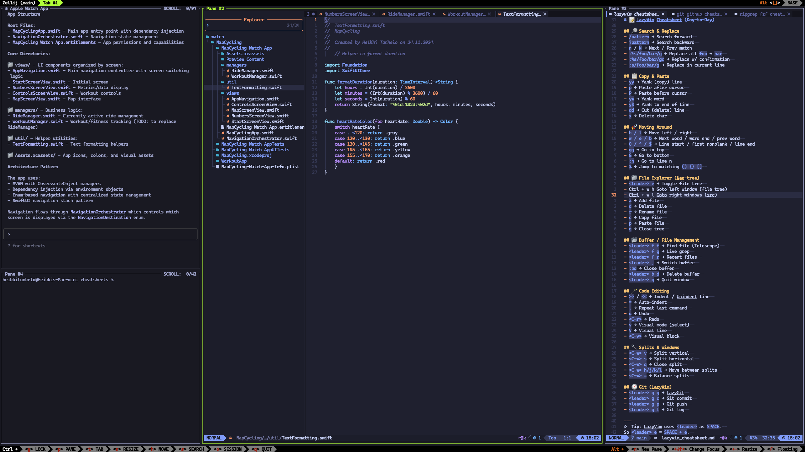

# Programming Cheatsheets

A collection of helpful cheatsheets for my development workflow using alacritty + zellij terminal setup with LazyVim.

## Setup Layout

My typical workspace is organized with zellij panes:
- **Top left**: Claude Code
- **Bottom left**: General command line
- **Center**: nvim (Lazyvim)
- **Right panel**: Cheatsheets (in nvim)

## Available Cheatsheets

- [`git_github_cheatsheet.md`](git_github_cheatsheet.md) - Git and GitHub CLI commands
- [`lazyvim_cheatsheet.md`](lazyvim_cheatsheet.md) - LazyVim keybindings and commands
- [`lazyvim_programming_workflows.md`](lazyvim_programming_workflows.md) - Programming workflows in LazyVim
- [`ripgrep_fzf_cheatsheet.md`](ripgrep_fzf_cheatsheet.md) - Search tools and fuzzy finding

## Usage

Keep these cheatsheets open in the right panel for quick reference while coding. Each file contains frequently used commands and shortcuts organized by category.